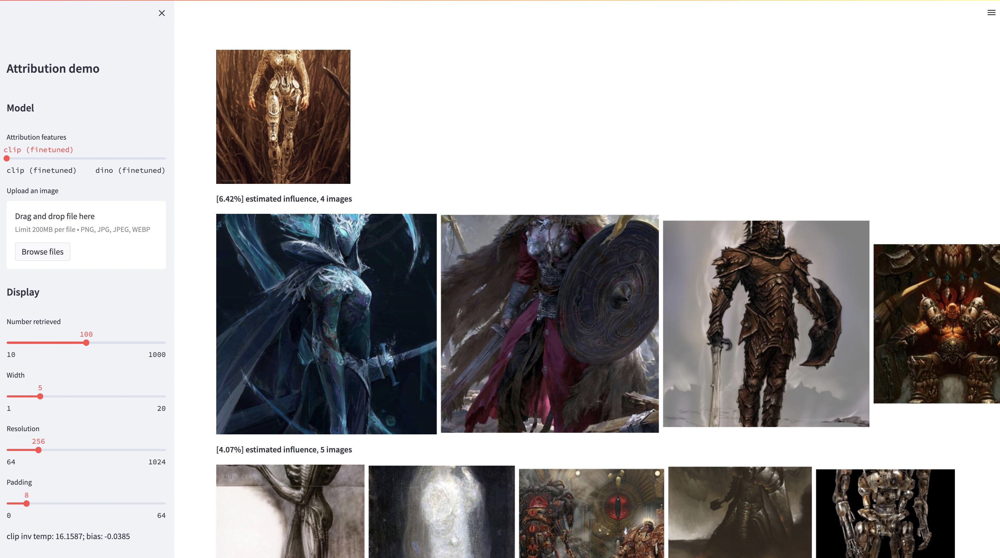

## Evaluating Data Attribution for Text-to-Image Models
[**Project**](https://peterwang512.github.io/GenDataAttribution/) | [**Paper**](https://arxiv.org/abs/2306.09345)

[Sheng-Yu Wang](https://peterwang512.github.io/)<sup>1</sup>, [Alexei A. Efros](https://people.eecs.berkeley.edu/~efros/)<sup>2</sup>, [Jun-Yan Zhu](https://cs.cmu.edu/~junyanz)<sup>1</sup>, [Richard Zhang](http://richzhang.github.io/)<sup>3</sup>.
<br> Carnegie Mellon University<sup>1</sup>, UC Berkeley<sup>2</sup>, Adobe Research<sup>2</sup>
<br>In [ICCV](https://arxiv.org/abs/2306.09345), 2023.


https://github.com/PeterWang512/GenDataAttribution/assets/20047790/9d07f403-f0fd-40b1-889a-0c14e1ecb4b7


### Abstract
While large text-to-image models are able to synthesize "novel" images, these images are necessarily a reflection of the training data. The problem of data attribution in such models -- which of the images in the training set are most responsible for the appearance of a given generated image -- is a difficult yet important one. As an initial step toward this problem, we evaluate attribution through "customization" methods, which tune an existing large-scale model toward a given exemplar object or style. Our key insight is that this allow us to efficiently create synthetic images that are computationally influenced by the exemplar by construction. With our new dataset of such exemplar-influenced images, we are able to evaluate various data attribution algorithms and different possible feature spaces. Furthermore, by training on our dataset, we can tune standard models, such as DINO, CLIP, and ViT, toward the attribution problem. Even though the procedure is tuned towards small exemplar sets, we show generalization to larger sets. Finally, by taking into account the inherent uncertainty of the problem, we can assign soft attribution scores over a set of training images.


## Setup
### Set up conda environment
```bash
conda env create -f environment.yaml
conda activate gen-attr
```

### Download model weights and data
```bash
# Download precomputed features of 1M LAION images
bash feats/download_laion_feats.sh

# Download jpeg-ed 1M LAION images for visualization
bash dataset/download_dataset.sh laion_jpeg

# Download pretrained models
bash weights/download_weights.sh
```

## Quick Start (Interactive Demo)
<p align="center">

</p>
We estimate training data influence by learned feature similarity. This demo takes in a Stable-Diffusion-generated image as query, and output influence scores from the 1M subset of LAION images. To launch the demo, run:

```bash
streamlit run streamlit_demo.py
```

## Dataset
We release our testset for evaluation. To download the dataset:
```bash
# Download the exemplar real images
bash dataset/download_dataset.sh exemplar

# Download the testset portion of images synthesized from Custom Diffusion
bash dataset/download_dataset.sh testset

# (Optional, can download precomputed features instead!)
# Download the uncompressed 1M LAION subset in pngs
bash dataset/download_dataset.sh laion
```
The dataset is structured as follows:
```
dataset
├── exemplar
│   ├── artchive
│   ├── bamfg
│   └── imagenet
├── synth
│   ├── artchive
│   ├── bamfg
│   └── imagenet
├── laion_subset
└── json
    ├──test_artchive.json
    ├──test_bamfg.json
    ├──...
```
All exemplar images are stored in `dataset/exemplar`, all synthesized images are stored in `dataset/synth`, and 1M laion images in pngs are stored in `dataset/laion_subset`. The JSON files in `dataset/json` specify the train/val/test splits, including different test cases, and serve as ground truth labels. Each entry inside a JSON file is a unique fine-tuned model. An entry also records the exemplar image(s) used for finetuning and the synthesized images generated by the model. We have four test cases: `test_artchive.json`, `test_bamfg.json`, `test_observed_imagenet.json`, and `test_unobserved_imagenet.json`.

#### (We will release the train and validation set in the near future!)

## Evaluation
After the testset, precomputed LAION features, and pretrained weights are downloaded, we can precompute the features from the testset by running `extract_feat.py`, and then evaluate the performance by running `eval.py`. Below are the bash scripts that runs the evaluation in batches:
```bash
# precompute all features from the testset
bash scripts/preprocess_feats.sh

# run evaluation in batches
bash scripts/run_eval.sh
```
The metrics are stored in `.pkl` files in `results`. Currently, the script runs each command sequentially. Please feel free to modify it to run the commands in parallel. The following command will parse the `.pkl` files into tables stored as `.csv` files:
```bash
python results_to_csv.py
```

## Citation
```
@inproceedings{wang2023evaluating,
  title={Evaluating Data Attribution for Text-to-Image Models},
  author={Wang, Sheng-Yu and Efros, Alexei A. and Zhu, Jun-Yan and Zhang, Richard},
  booktitle={ICCV},
  year={2023}
}
```

## Acknowledgement
We thank Aaron Hertzmann for reading over an earlier draft and for insightful feedback. We thank colleagues in Adobe Research, including Eli Shechtman, Oliver Wang, Nick Kolkin, Taesung Park, John Collomosse, and Sylvain Paris, along with Alex Li and Yonglong Tian for helpful discussion. We appreciate Nupur Kumari for guidance with Custom Diffusion training, Ruihan Gao for proof-reading the draft, Alex Li for pointers to extract Stable Diffusion features, and Dan Ruta for help with the BAM-FG dataset. We thank Bryan Russell for pandemic hiking and brainstorming. This work started when SYW was an Adobe intern and was supported in part by an Adobe gift and J.P. Morgan Chase Faculty Research Award.
